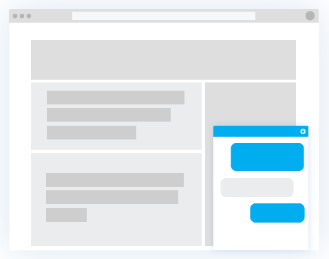
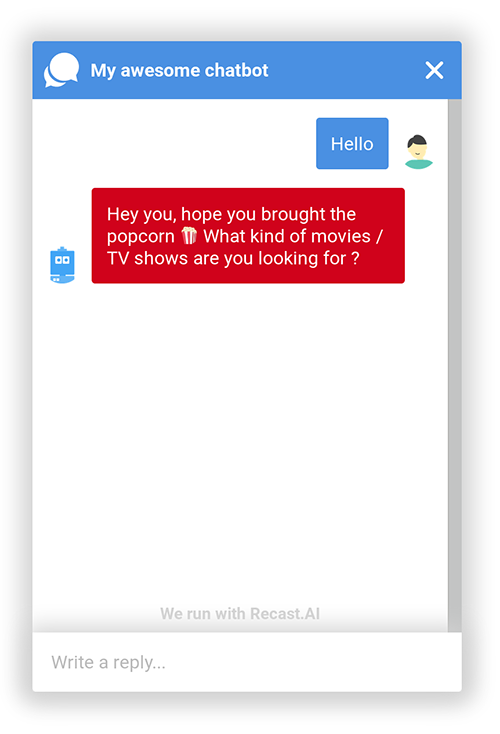
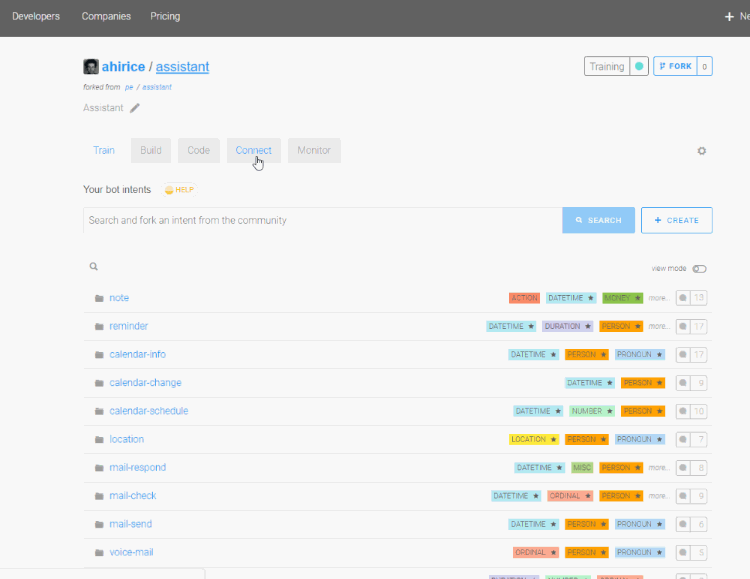

<div align="center">
  
</div>

# SAP Conversational AI Webchat
| [Default Usage](#usage) | [Self-Hosted Installation](#self-hosted-webchat) | [Getting Started on SAP Conversational AI]( #getting-started-with-sap-conversational-ai) | [License](#license) |
|---|---|---|---|
<div>
<a href="https://slack.cai.tools.sap/">💬 Questions / Comments? Join the discussion on our community Slack channel!</a>
</div>

## What is a webchat?

The SAP Conversational AI webchat let you **deploy a bot straight to a website**. It will be embed and available through a chat box on your pages.
The webchat is one of the many channels available on [SAP Conversational AI](https://cai.tools.sap), and end-to-end bot building platform.
This webchat is built using the [React](https://github.com/facebook/react) library, along with [Redux](https://github.com/reactjs/redux) for state managment.

<div align="center">
  
</div>

## Compatibility

This webchat is supported by all mobile and desktop browsers in their latest versions.
Internet Explorer support starts at version 9.0.

## Usage

Three different installations on the webchat module are possible.
- The default is the simplest and fatest route, and offers some customization options.
- The self-hosted webchat offers even more customization option, but you'll have to deal with the hosting and maintenance of the module.
- Use it as a React component

### Default webchat

To use the webchat, you need an account on [SAP Conversational AI](https://cai.tools.sap) and a bot.
Then, go to the **CONNECT** tab and click on **Webchat**. It will open a window that lets you adjust your webchat settings, including:
* color scheme,
* header customization,
* bot and user pictures,
* webchat logo and call to action,
* conversation duration

Once you're satisfied with the settings, click on the **SAVE** button. A script tag appears, and you just have to copy paste it in your web page to embed the webchat. The script must be placed in the `<body>` tag.

<div align="center">
  
</div>


### Self-hosted webchat

If you want to customize your webchat even more, you can opt for a self-hosted installatiton. Just fork this project to get started!

#### Installation

Clone the repository you forked, and install the dependencies.

```
$> git clone YOUR_REPO_URL
$> cd webchat
$> npm install
```

#### Run in development mode

```
$> npm run start
```

#### Eslint + prettier

```
$> npm run prettier
```

#### Build for production

```
$> npm run build
```

#### Use your webchat

Once you're done, build it and host it.
To use it instead of the default one provided by SAP Conversational AI, you need to set up the Webchat channel in the **CONNECT** tab of your bot.
You'll be using the same script as the default installation, but you have **to replace the src field by your own URL**.


```
<script
  src="YOUR_WEBCHAT_URL"
  ...
></script>
```

### React component
You can import the webchat as a React component like the following example:
``` js
import CaiWebchat from 'webchat';

export default class ReactWebchat extends Component {
  render() {
    return (
      <CaiWebchat
        onRef={ref => {
          this.webchat = ref;
        }}
        channelId={YOUR_CHANNEL_ID}
        token={YOUR_TOKEN}
        preferences={{
          accentColor: '#E05A47',
          complementaryColor: '#FFFFFF',
          botMessageColor: '#707070',
          botMessageBackgroundColor: '#F6F6F6',
          backgroundColor: '#FFFFFF',
          headerLogo: 'https://cdn.cai.tools.sap/webchat/webchat-logo.svg',
          headerTitle: 'My awesome chatbot',
          botPicture: 'https://cdn.cai.tools.sap/webchat/bot.png',
          userPicture: 'https://cdn.cai.tools.sap/webchat/user.png',
          onboardingMessage: 'Come speak to me!',
          expanderLogo: 'https://cdn.cai.tools.sap/webchat/webchat-logo.svg',
          expanderTitle: 'Click on me!',
          conversationTimeToLive: 24,
          openingType: 'never',
          welcomeMessage: 'Hello world !',
        }}
        getLastMessage={message => {
          console.log(message)
        }}
      />
    );
  }
}
```

#### Props
|Name|Type|Required|Description|
|---|---|---|--|
|onRef|function|false| Function which returns ref of the webchat|
|channelId|string|true|Channel id (you can get in SAP Conversational AI)|
|token|string|true|Token (you can get in React.ai)|
|preferences|object|true| Object containing some settings|
|getLastMessage|function|false|Function which returns the last message sent by the webchat

#### Methods
You can access these methods by using the reference of the component (use `OnRef`)
```
<CaiWebchat
  onRef={ref => this.webchat = ref }
>
...

this.webchat.clearMessages();
```
|Name|Description|
|---|---|
|clearMessages()|Clear all messages in the webchat|

### Bot Memory management
One thing you might want to do is to send custom data from your website to the bot, like the name of the logged in user, his ID, the page he is currently on (to send product suggestions for example). To do that, you can define a `window.webchatMethods.getMemory` function, the webchat will call it before sending user messages, and send your arbitrary payload along with the message to the bot.

If you use SAP Conversational AI's bot-builder (you should :)), your payload will be put in the memory of the conversation, meaning that you will be able to access this data in your bot-builder. Let's say you send this as payload : `{ "userName": "Dominik", "userId": 123456 }`, you will then be able to send this as a greeting message : `Hello {{ memory.userName }} ! How do you do ?`.

`window.webchatMethods.getMemory` must return a JSON object or a Promise resolving a JSON object :
  - `{ "memory": { ... }, "merge": <boolean> }`
where `{ ... }` is your arbitrary payload. `merge` is an instruction for the bot-builder. If set to true, the payload will be merged with the existing memory, overriding common keys but keeping the ones absent from the payload. If set to false, the memory will be replaced entirely by your payload.

If your `getMemory` function takes more than 10 seconds, the message will be sent anyway, without waiting for your function to finish.

#### Examples :
```html
<html>
  <head>
    <script>
      window.webchatMethods = {
        // called at each user message
        getMemory: (conversationId) => {
          const memory = { userName: 'Dominik Bousquet', userId: 123456 }
          return { memory, merge: true }
        }
      }
    </script>
  </head>
  <body>
    <script src="https://cdn.cai.tools.sap/webchat/webchat.js"
      channelId="<channelId>"
      token="<token>"
      id="cai-webchat"
    ></script>
  </body>
</html>
```

```javascript
window.webchatMethods = {
  getMemory: (conversationId) => {
    const getCookie = (name) => {
      const value = document.cookie.match('(^|;) ?' + name + '=([^;]*)(;|$)')
      return value ? value[2] : null
    }
    const userName = getCookie('userName')
    const memory = { userName, currentUrl: window.location.href }
    return { memory, merge: true }
  }
}
```

```javascript
window.webchatData = {}
window.webchatMethods = {
  getMemory: (conversationId) => {
    if (window.webchatData.savedUserData) {
      return { memory: window.webchatData.savedUserData, merge: true }
    }
    return new Promise((resolve, reject) => {
      axios.get('/current_user')
        .then((response) => {
          const memory = { userName: response.data.name, userId: response.data.id }
          window.webchatData.savedUserData = memory
          resolve({ memory, merge: true })
        })
        .catch(reject)
    })
  }
}
```

```javascript
window.webchatData = {}
window.webchatMethods = {
  getMemory: (conversationId) => {
    if (!window.webchatData.oriUrl) {
      window.webchatData.oriUrl = window.location.href
    }
    // merge: false - reset the conversation if the user
    // switched to another page since the first message
    if (window.webchatData.oriUrl !== window.location.href) {
      return { memory: {}, merge: false }
    }
    return { memory: { userName: 'Dominik' }, merge: true }
  }
}
```


## Getting started with SAP Conversational AI

We build products to help enterprises and developers have a better understanding of user inputs.

-   **NLP API**: a unique API for text processing, and augmented training.
-   **Bot Building Tools**: all you need to create smart bots powered by SAP Conversational AI's NLP API. Design even the most complex conversation flow, use all rich messaging formats and connect to external APIs and services.
-   **Bot Connector API**: standardizes the messaging format across all channels, letting you connect your bots to any channel in minutes.

Learn more about:

| [API Documentation](https://cai.tools.sap/docs/api-reference/) | [Discover the platform](https://cai.tools.sap/docs/create-your-bot) | [First bot tutorial](https://cai.tools.sap/blog/build-your-first-bot-with-cai-ai/) | [Advanced NodeJS tutorial](https://cai.tools.sap/blog/nodejs-chatbot-movie-bot/) | [Advanced Python tutorial](https://cai.tools.sap/blog/python-cryptobot/) |
|---|---|---|---|---|

## License

Copyright (c) [2016] SAP Conversational AI

Permission is hereby granted, free of charge, to any person obtaining a copy of this software and associated documentation files (the "Software"),
to deal in the Software without restriction, including without limitation the rights to use, copy, modify, merge, publish, distribute, sublicense,
and/or sell copies of the Software, and to permit persons to whom the Software is furnished to do so, subject to the following conditions:

The above copyright notice and this permission notice shall be included in all copies or substantial portions of the Software.

THE SOFTWARE IS PROVIDED "AS IS", WITHOUT WARRANTY OF ANY KIND, EXPRESS OR IMPLIED, INCLUDING BUT NOT LIMITED TO THE WARRANTIES OF MERCHANTABILITY,
FITNESS FOR A PARTICULAR PURPOSE AND NON INFRINGEMENT. IN NO EVENT SHALL THE AUTHORS OR COPYRIGHT HOLDERS BE LIABLE FOR ANY CLAIM, DAMAGES OR OTHER LIABILITY,
WHETHER IN AN ACTION OF CONTRACT, TORT OR OTHERWISE, ARISING FROM, OUT OF OR IN CONNECTION WITH THE SOFTWARE OR THE USE OR OTHER DEALINGS IN THE SOFTWARE.
